<div align="center">


# 🔮 오행가디언즈 · lucky-real-app

**만세력 엔진을 매일 쓰는 오행 라이프 RPG 경험으로 바꾸는 Flutter 앱 모노레포**

오행가디언즈는 출생 정보와 오늘의 흐름을 바탕으로 **오늘의 수호신, 운세, 루틴, 카드 도감, 시장관찰, 케미**를 무료·오프라인 우선으로 제공하는 스마트폰 앱입니다.

<p>
  
  
  
  
  
  
  
  
</p>

</div>

---

## ✨ 핵심 요약

| 구분 | 내용 |
|---|---|
| 앱 이름 | **오행가디언즈** (Ohaeng Guardians) |
| 패키지 / 번들 ID | `ai.coreline.ohaengguardians` |
| 앱 형태 | Flutter Android/iOS 스마트폰 앱 (서버 없음) |
| 제품 원칙 | 무료, 오프라인 우선, 개인정보 최소화, 광고/결제/구독 없음 |
| 핵심 루프 | 출생 정보 입력 → 오늘 수호신 확인 → 운세 읽기 → 루틴 수행 → 카드 수집 → 케미 공유 |
| 화면 구성 | 하단 6탭 + 온보딩/수호신 공개/설정/기록/케미 상세 등 총 13개 라우트 |
| 데이터 저장 | Drift/SQLite 기반 로컬 저장 (스키마 v4, 14개 테이블) |
| 계산 엔진 | 순수 Dart 만세력 포팅 + `EngineGateway` 경계, TS 만세력 엔진(`manseryeok-engine`)이 정본 |
| 지원 생년 범위 | **1908-04-01 ~ 2101-12-31** (게이트웨이 검증) |
| 규칙 버전 | `krlt-yaja-2026.07` (한국 법정시 + 야자시 기본 + 절기 월주) |

> ⚠️ 이 앱은 오락·자기성찰용 콘텐츠입니다. 의료, 투자, 법률, 재무 판단을 대신하지 않습니다.

---

## 🌐 웹 데모와 MCP 검증

이 저장소에는 목적이 다른 웹 데모가 2개 있습니다. 두 앱은 통합하지 않고, 같은 입력에 대한 결과 교차검증으로만 연결합니다.

| 구분 | `web-lucky` | `web-mcp-daily` |
|---|---|---|
| 목적 | 브라우저에서 `manseryeok-engine` 직접 실행 | `manseryeok-mcp` 서버의 `/mcp` 실전 호출 검증 |
| 계산 위치 | 브라우저 내부 | MCP HTTP 서버 |
| 서버 필요 | 없음 | 필요 |
| 현재 구현 | 연도별 data shard, 비동기 browser API, bundle budget | MCP-only guard, 인증 preflight, 응답 크기 budget |
| 남은 외부 과제 | 공개 호스팅 또는 오프라인 설치 요구 확정 시 PWA 재검토 | PlayMCP 콘솔 확인과 운영 HTTPS 호스팅 |
| 금지 조건 | MCP 서버 의존으로 전환하지 않음 | 엔진 직접 import 또는 local fallback 금지 |

현재 기준선은 다음 명령으로 확인합니다.

```bash
npm --prefix web-lucky run build
npm --prefix web-mcp-daily run build
node scripts/web-demo-size-report.mjs
```

엔진 직접 경로와 MCP 경로의 구조화 결과 일치는 다음 명령으로 확인합니다.

```bash
npm --prefix mcp-server run build
node scripts/cross-check-engine-mcp.mjs
```

현재 구현과 종료 검증 범위는 [웹/MCP 고도화 계획](dev-plan/implement_20260713_103828.md)과
[종료 문서 정합성 계획](dev-plan/implement_20260713_154958.md)에 기록합니다. 실제 PlayMCP
콘솔 등록과 운영 HTTPS 배포는 로컬 완료 범위에 포함하지 않습니다.

---

## 📱 realapp 대표 화면

아래 이미지는 **S25 안드로이드 디바이스**에서 `realapp` 디버그 빌드를 실행한 뒤 2026-07-09에 다시 캡쳐한 6개 하단 탭의 대표 화면입니다.

<table>
  <tr>
    <td align="center" width="33%">
      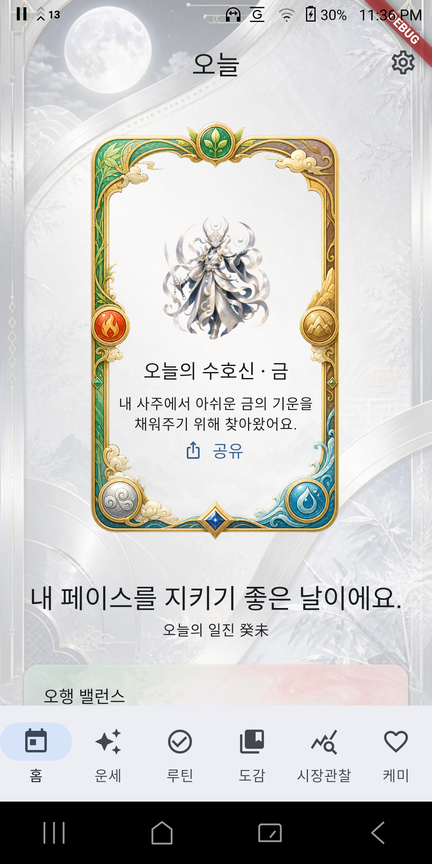<br>
      <b>🏠 홈</b><br>
      오늘의 수호신, 일진, 오행 밸런스, 공유 CTA
    </td>
    <td align="center" width="33%">
      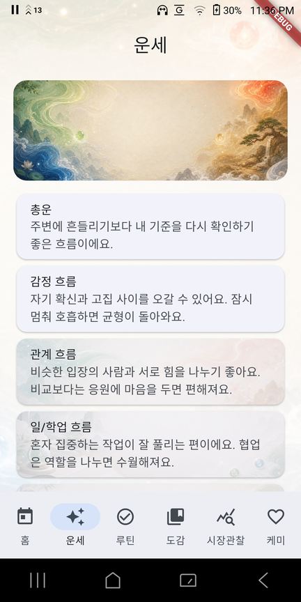<br>
      <b>✨ 운세</b><br>
      총운, 감정, 관계, 일/학업, 컨디션 흐름
    </td>
    <td align="center" width="33%">
      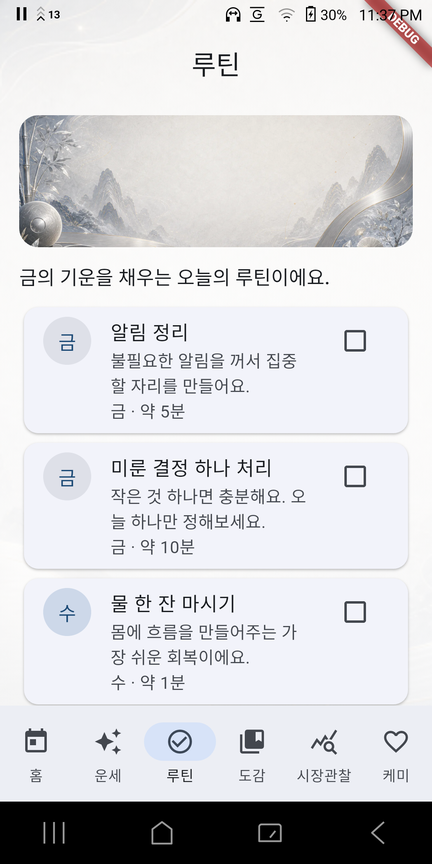<br>
      <b>✅ 루틴</b><br>
      부족한 오행을 채우는 체크리스트형 실천 루틴
    </td>
  </tr>
  <tr>
    <td align="center" width="33%">
      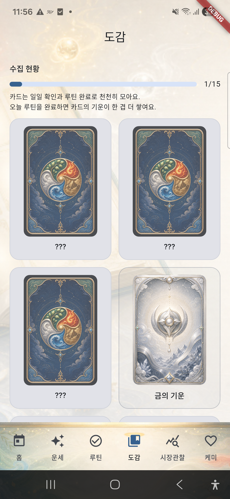<br>
      <b>📚 도감</b><br>
      일일 확인과 루틴 완료로 모으는 무료 카드 컬렉션
    </td>
    <td align="center" width="33%">
      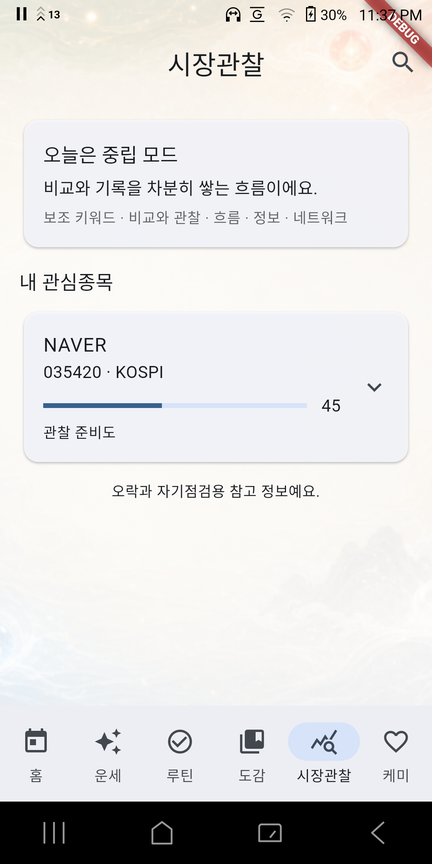<br>
      <b>📈 시장관찰</b><br>
      관심종목 리듬과 체크리스트 기반 관찰 준비도
    </td>
    <td align="center" width="33%">
      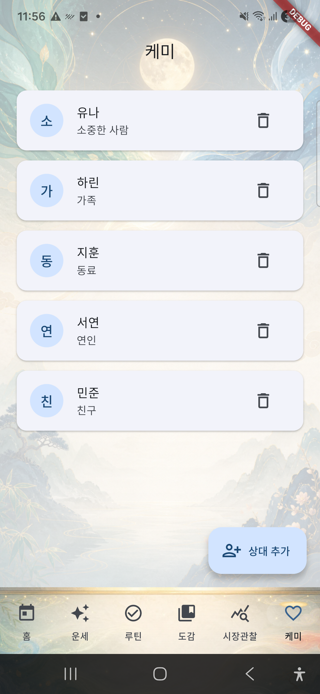<br>
      <b>💞 케미</b><br>
      상대 프로필, 관계 타입, 케미 리듬과 공유 플로우
    </td>
  </tr>
</table>

### 추가 캡쳐 화면 3종

아래 3개 이미지는 README 갱신 과정에서 추가로 캡쳐한 안드로이드 디바이스 화면입니다.

<table>
  <tr>
    <td align="center" width="33%">
      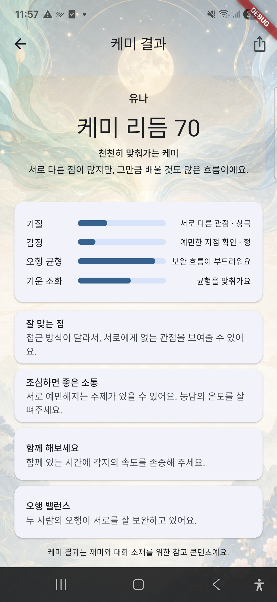<br>
      <b>💞 케미 결과</b><br>
      시드된 상대 유나의 케미 리듬과 관계 해석
    </td>
    <td align="center" width="33%">
      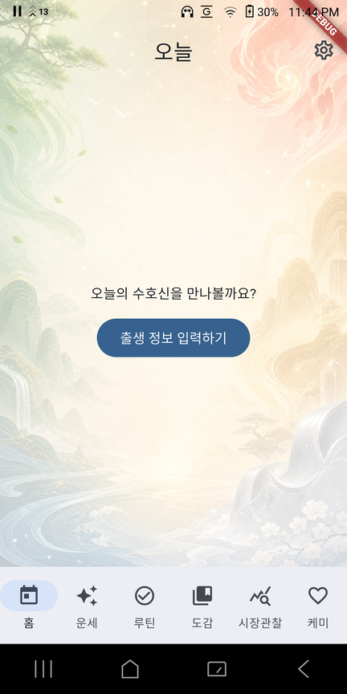<br>
      <b>🚪 프로필 없는 시작</b><br>
      출생 정보 입력 전 첫 홈 CTA
    </td>
    <td align="center" width="33%">
      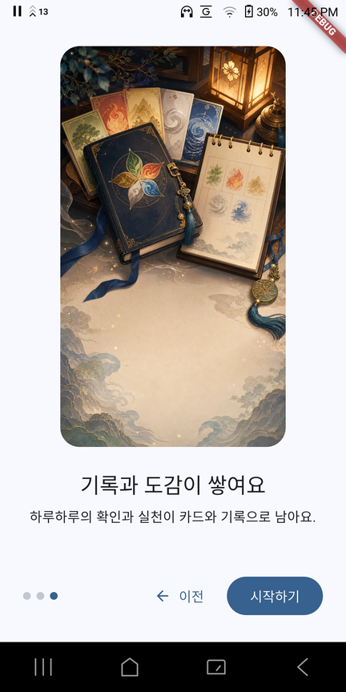<br>
      <b>📈 시장관찰 관심종목</b><br>
      관심종목 5개와 관찰 준비도 목록 화면
    </td>
  </tr>
</table>

---

## 🧭 제품 개요와 데일리 루프

오행가디언즈는 “정답을 알려주는 점술 앱”이 아니라, 오늘의 흐름을 이해하고 스스로를 돌보는 **일상형 오행 가이드**를 지향합니다. 만세력 표를 첫 화면에 내세우는 대신 “오늘 무엇을 보면 되고 무엇을 하면 좋은지”를 먼저 보여주고, 결과 소비보다 하루 루틴 실천과 수집·공유의 재미를 강조합니다.

```
아침 알림/앱 실행
  → 홈에서 오늘의 수호신 + 한 줄 운세 확인
  → 오행 밸런스와 분야별 운세 훑기
  → 추천 루틴 1~3개 중 하나 선택·체크
  → 감정/컨디션 기록
  → 루틴 완료·일일 확인으로 무료 카드/도감 보상
  → 원하면 친구/연인과 케미 카드 공유
  → 기록 캘린더에 오늘의 수호신·루틴·감정·보상이 축적
```

핵심은 “운세를 봤다”에서 끝나지 않고 **오늘 할 행동 하나를 고르고, 체크하고, 보상을 받는 구조**입니다.

---

## 🗺️ 전체 화면·라우트 맵

앱은 하단 6탭을 `StatefulShellRoute.indexedStack`로 유지하고, 온보딩·수호신 공개·설정·기록·케미 상세는 탭 밖 전체 화면 라우트로 분리합니다. (정의: [`realapp/lib/app/router.dart`](realapp/lib/app/router.dart), [`realapp/lib/app/route_paths.dart`](realapp/lib/app/route_paths.dart))

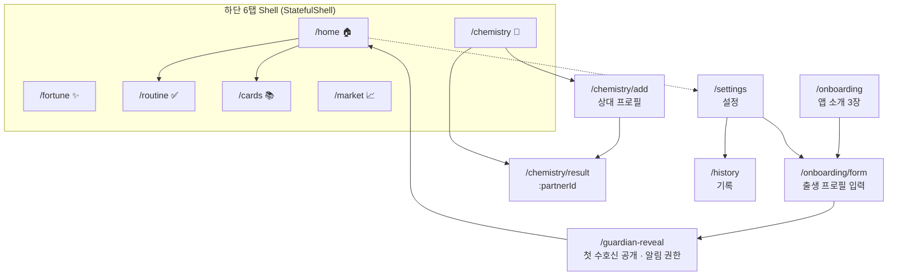

| 라우트 | 화면 | 진입 경로 |
|---|---|---|
| `/onboarding` | 앱 소개 3장 (수호신/루틴/도감) | 프로필 없을 때 홈 CTA |
| `/onboarding/form` | 출생 프로필 입력 폼 | 온보딩 마지막 · 설정의 출생정보 수정 |
| `/guardian-reveal` | 첫 수호신 공개 + 알림 권한 요청 | 신규 프로필 저장 직후 |
| `/home` | 🏠 홈 (오늘 요약) | 앱 시작 기본 위치 |
| `/fortune` | ✨ 운세 상세 | 하단 탭 |
| `/routine` | ✅ 오행 루틴 | 하단 탭 · 홈 CTA |
| `/cards` | 📚 카드 도감 | 하단 탭 · 홈 CTA |
| `/market` | 📈 시장관찰 | 하단 탭 |
| `/chemistry` | 💞 케미 상대 목록 | 하단 탭 |
| `/chemistry/add` | 케미 상대 프로필 추가 | 케미 탭 FAB |
| `/chemistry/result/:partnerId` | 케미 결과·해석·공유 | 상대 선택 |
| `/settings` | 설정 (알림/프로필/삭제/라이센스) | 홈·마이페이지 진입점 |
| `/history` | 기록 목록 (감정·수호신 로그) | 설정 |

---

## 📋 탭별 기능 상세

| 탭 | 사용자 가치 | 주요 기능 |
|---|---|---|
| 🏠 홈 | 오늘 무엇을 보면 되고 무엇을 하면 좋은지 바로 확인 | 오늘의 수호신 카드, 한 줄 운세, 일진(일주 간지)·절기, 오행 밸런스 바, 총운/관계운/행동 3카드, 루틴 CTA, 수호신 공유. 로딩/재시도/최초진입/오늘보기 5개 상태 처리 |
| ✨ 운세 | 만세력 결과를 쉬운 문장으로 읽기 | 총운·감정·관계·일/학업·컨디션·조심할 점·오행 키워드 7개 섹션 + 접히는 용어 사전(일진/일간/십신/오행/절기) + 엔터테인먼트 고지 |
| ✅ 루틴 | 운세를 행동으로 연결 | 오행별 1~20분 루틴 추천(최대 3개, 최소 1개는 5분 이하 보장), 완료 체크, 연속 달성(스트릭), 5개 기분 칩 기록, 완료 시 무료 보상. 미완료 페널티 없음 |
| 📚 도감 | 반복 사용 동기와 수집 재미 | 총 15종 카드(오행 5·양수호신 5·음수호신 5), 보유/미보유 표시, 진행률 바, 상세 다이얼로그(획득 소스·힌트). 결제 UI 없음 |
| 📈 시장관찰 | 투자 조언이 아닌 관찰 습관 만들기 | 로컬 KR 종목 마스터 검색·관심종목 등록(메모·태그), 관찰 준비도 점수, 4단계 사전 체크리스트, 이름 오행, 자기점검 문구 |
| 💞 케미 | 관계를 가볍게 대화 소재로 변환 | 상대 추가(관계 타입: 친구/연인/가족/동료/기타), 오행·십신 기반 케미 리듬, 잘 맞는 점·조심할 소통·함께 좋은 팁, 공유 카드 |

### 탭 밖 주요 화면

- **온보딩 소개 → 출생 프로필 폼**: 닉네임(최대 20자), 생년월일(1908-04-01~오늘로 제한), 양력/음력·윤달, 출생 시간 “모름” 토글(기본 12:00), 성별 선택(미선택 시 대운 생략). 저장 전 `calculateFourPillars`를 **선검증**으로 호출해 범위/법정시 오류를 막습니다.
- **수호신 공개(`/guardian-reveal`)**: 애니메이션 공개와 함께 첫 카드(`card_{guardianId}`, 소스 `first_visit`)를 1회 지급하고, **이 시점에만** 알림 권한을 요청해 허용 시 아침 수호신 알림을 켭니다.
- **설정(`/settings`)**: 닉네임 변경, 기록 화면 링크, 알림 3종(종류별 on/off + 시간 선택), 출생정보 수정, **내 데이터 전체 삭제**(알림 취소 → 로컬 데이터 삭제 → 홈 복귀), 엔터테인먼트 고지·라이센스 안내.
- **기록(`/history`)**: 최근 `DailyRecord`(날짜·기분·수호신)를 읽기 전용 리스트로 표시. 월 캘린더 뷰는 백로그.
- **케미 추가/결과**: 상대 프로필 입력 시 민감정보 고지 필수. 결과 화면은 매번 엔진으로 재계산 후 캐시하며 총점 + 4개 세부 항목(기질/감정/오행/기운)과 해석을 보여주고 공유로 연결합니다.

---

## 🧩 제품 흐름

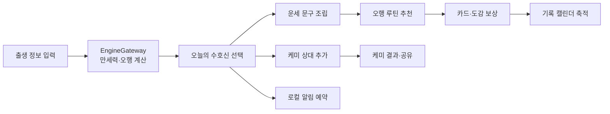

1. 사용자는 닉네임, 생년월일, 양력/음력, 출생 시간 여부, 성별을 입력합니다.
2. 앱은 `EngineGateway`를 통해 원국(사주팔자), 오행 분포, 오늘 일진/세운/월운을 계산하고 오늘 스냅샷을 캐시합니다.
3. `GuardianSelector`가 부족한 오행 기준으로 오늘의 수호신을 결정하고, 콘텐츠 레이어가 근거 코드를 문구로 조립합니다.
4. 홈은 “오늘의 수호신 + 한 줄 운세 + 오행 밸런스”를 먼저 보여주고, 루틴 탭은 보완할 오행을 일상 행동으로 변환합니다.
5. 도감은 일일 확인과 루틴 완료를 결정론적(seed 기반) 무료 보상 루프로 연결합니다.
6. 케미는 상대 프로필을 등록해 관계별 해석과 공유용 결과를 제공합니다.

---

## 🏛️ 아키텍처 개요

realapp은 **Feature-first + Layered Architecture**를 따르며, 계산 엔진은 Flutter에 의존하지 않는 순수 Dart로 격리합니다. 상태 관리·의존성 주입은 `flutter_riverpod`으로 구성합니다.

```text
presentation  →  application  →  domain  →  data interface
                                   engine  →  순수 Dart only (Flutter import 금지)
platform services (알림·공유)      →  adapter/service 안에서만 격리
```

| 레이어 | 위치 | 책임 |
|---|---|---|
| `app/` | 앱 부트스트랩 | `MaterialApp.router`, go_router 셸, 테마, Riverpod 프로바이더 정의 |
| `core/` | 공통 기반 | 오행 도메인 enum, 오행 색상·에셋 경로 상수, `AppFailure` 결과 타입, `AppClock`(KST 주입) |
| `engine/` | 계산 | 만세력 Dart 포팅, 오행 밸런스, 수호신 선택, 케미 산식, `EngineGateway` 계약/구현 |
| `data/` | 저장 | Drift `AppDatabase`, 7개 리포지토리 |
| `features/` | 화면·기능 | 탭·화면별 presentation / application / domain / content |

핵심 설계 원칙:

- **EngineGateway 경계** — UI는 명리 계산을 직접 하지 않고 [`EngineGateway`](realapp/lib/engine/gateway/engine_gateway.dart) 인터페이스에만 의존합니다. 실제 구현은 `main()`에서 `DartEngineGateway`로 주입하고, 테스트는 `MockEngineGateway`/메모리 DB로 교체합니다. 기본값을 두지 않아 override 누락이 조용히 Mock으로 출시되는 사고를 방지합니다.
- **계산과 문구 분리** — 게이트웨이는 계산값과 근거 코드만 반환하고, 사용자 문구는 각 기능의 `content/` 레이어(예: [`fortune_content.dart`](realapp/lib/features/fortune/content/fortune_content.dart), [`chemistry_content.dart`](realapp/lib/features/chemistry/content/chemistry_content.dart))가 조립합니다. 문구 수정이 엔진 재검증을 유발하지 않습니다.
- **오프라인 우선 캐싱** — 오늘(`Asia/Seoul`) `DailySnapshot`이 있으면 재사용하고, 날짜나 `engineVersion`이 바뀌면 재계산합니다. 일일 보상은 `owned_cards`/`app_meta`의 지급 이력이 우선하므로 기기 시간을 되돌려도 중복 지급되지 않습니다.
- **날짜 주입** — “오늘” 의존성은 `AppClock`으로 주입해 테스트에서 재현 가능하게 합니다.

---

## 🗄️ 데이터 모델 (로컬 DB)

[`realapp/lib/data/local/app_database.dart`](realapp/lib/data/local/app_database.dart) — Drift 기반, **스키마 v4, 14개 테이블**. DB 파일은 백그라운드 아이솔레이트에서 `<앱문서폴더>/ohaeng_guardians.db`로 지연 오픈합니다.

| 테이블 | 용도 | 도입 |
|---|---|---|
| `user_profiles` | 로컬 사용자(닉네임·톤·타임존) | v1 |
| `birth_profiles` | 대표 출생 프로필(양/음력·윤달·시간미상·성별) | v1 |
| `daily_snapshots` | 하루치 계산 캐시(원국+일진+분석+수호신) | v1 |
| `daily_records` | 감정/메모 기록(하루 1건) | v1 |
| `guardian_cards` | 카드 마스터 카탈로그 | v1 |
| `owned_cards` | 보유 카드·중복 카운트·최초 획득 소스 | v1 |
| `routine_logs` | 루틴 완료 로그 | v1 |
| `routine_streaks` | 연속 달성/최장 기록 | v1 |
| `app_meta` | 엔진/규칙 버전, 1회성 보상 지급 키 | v1 |
| `chemistry_profiles` | 케미 상대 프로필 | v2 |
| `chemistry_results` | 케미 결과 캐시 | v2 |
| `notification_settings` | 알림 종류별 on/off·시각 | v3 |
| `market_instruments` | 로컬 KR 종목 마스터 | v4 |
| `market_watch_items` | 관심종목·메모·태그 | v4 |

- **ID 규칙** — 마스터 데이터는 의미 있는 semantic id, 하루 1건 사용자 데이터는 결정론적 `{kind}_{userId}_{yyyyMMdd}`, 나머지는 UUID.
- **마이그레이션** — `onUpgrade`에서 v2(케미)·v3(알림)·v4(시장) 테이블을 증분 생성하며 기존 데이터는 무변경.
- **리포지토리** — `profile`, `daily_fortune`, `card`, `routine`, `record`, `chemistry`, `market` 7종이 presentation의 DB 직접 접근을 차단합니다.

---

## 🧮 계산 엔진

### 순수 Dart 만세력 포팅 — [`realapp/lib/engine/manseryeok/`](realapp/lib/engine/manseryeok/)

TypeScript 정본 엔진을 Dart로 포팅한 계층으로, 각 파일이 대응하는 TS 원본을 헤더에 명시합니다. Flutter import가 없습니다.

| 모듈 | 역할 |
|---|---|
| `temporal.dart` | 날짜/시각 프리미티브, UTC↔타임스탬프, KST(+9h) |
| `errors.dart` | `ManseryeokErrorCode`(range/data/ambiguous/nonexistent/policy) |
| `engine_data.dart` | 음양력·절기 JSON 테이블 로드(에셋 로더 주입) |
| `lunar_solar.dart` | 양력↔음력 테이블 변환(윤달 포함) |
| `solar_terms.dart` | 24절기(12절) 조회, KST 보정 |
| `korean_legal_time.dart` | 한국 표준시·과거 DST 구간 → 법정시 보정 |
| `normalized_context.dart` | 입력 정규화, 조자시/야자시·날짜 경계 규칙 |
| `ganji.dart` | 60갑자 사주 사주(년/월/일/시)·세운 계산 |
| `sipsin.dart` | 십신·지장간 산출 |

- **데이터 테이블**: `assets/engine/lunar-solar.generated.json`(~4MB), `assets/engine/solar-terms.generated.json`(~1.1MB) — 스플래시 구간에서 1회 로드.
- **지원 범위**: 게이트웨이가 **1908-04-01 ~ 2101-12-31**을 검증하고, `Asia/Seoul` 외 타임존은 거부합니다.

### 오행 밸런스 & 수호신 선택 — [`realapp/lib/engine/five_elements/`](realapp/lib/engine/five_elements/)

- **오행 밸런스**: 천간 가중치 1.0, 지장간 본기 1.0, 나머지 지장간 0.3으로 목·화·토·금·수 분포를 계산하고 100 기준으로 정규화합니다.
- **수호신 선택(결정론적)**: 오늘 부족한 오행(`weakest`)을 기본으로 고르되, 어제 수호신과 같으면 다음으로 부족한 오행으로 순환(수집 다양성)합니다. 오늘 일간 오행과 상생/일치하면 `dailyTengodFocus`, 지배 오행을 극하면 `dominantElementBalance` 근거 코드를 덧붙입니다. 수호신 id는 `guardian_{element}_yang`.

### 케미(궁합) 산식 — [`realapp/lib/engine/compatibility/chemistry_engine.dart`](realapp/lib/engine/compatibility/chemistry_engine.dart)

TS `compatibility` 산식이 정본이며 총점 100점입니다.

```
총점 = 일간 30 + 일지 25 + 오행 보완 25 + 구성(본명성) 20
등급 = S≥85 · A≥70 · B≥55 · C≥40 · 그 외 D
```

- **일간(30)**: 천간합 30 / 상생 20 / 비화·보통 15 / 상극 10 / 천간충 5
- **일지(25)**: 육합 25 / 상생 18 / 비화 15 / 상극 8 / 형 5 / 충 3
- **오행 보완(25)**: 두 사람의 간지 10자를 오행별로 집계해 이상치(16/5) 대비 편차로 점수화, 합쳐도 0개인 오행을 `missingElements`로 보고
- **구성(20)**: 본명성(구성학) 관계로 동일 오행 12 / 상생 20 / 그 외 5

> 결과 화면은 위 네 항목을 각각 **기질(일간)/감정(일지)/오행/기운(구성)** 라벨로 표시합니다.

### EngineGateway 계약

[`EngineGateway`](realapp/lib/engine/gateway/engine_gateway.dart)는 4개 메서드를 제공합니다: `calculateFourPillars`, `calculateDailyCycle`(정오 12:00 KST 고정), `calculateDailyAnalysis`, `calculateChemistry`. 응답에는 사용자 문구 필드가 없고 계산값·근거 코드만 담기며, 모든 응답에 `meta.engineVersion`/`meta.ruleVersion`이 포함됩니다. Dart 게이트웨이 메타는 `0.1.0-dart` / `krlt-yaja-2026.07`. 자세한 JSON 계약은 [`realapp/docs/09-engine-gateway-contract.md`](realapp/docs/09-engine-gateway-contract.md).

---

## 🔔 알림 & 🖼️ 공유

### 로컬 알림 — [`realapp/lib/features/notifications/`](realapp/lib/features/notifications/)

서버 푸시 없이 `flutter_local_notifications` + `timezone`(Asia/Seoul)으로 매일 반복 알림만 예약합니다.

| 종류 | 기본 시각 | 내용 |
|---|---|---|
| `morning_guardian` | 08:00 | 오늘의 수호신 도착 |
| `evening_routine` | 20:00 | 오늘의 오행 루틴 체크 |
| `card_unclaimed` | 21:00 | 미수령 카드 보상 |

`NotificationScheduler`가 설정 저장 시 예약/취소하고, 앱 시작 시 `restoreSchedules()`로 재부팅·업데이트 대비 재예약합니다. 데이터 삭제 시 `cancelAll()`로 전량 취소합니다.

### 공유 이미지 — [`realapp/lib/features/share/`](realapp/lib/features/share/)

- 공유 전용 위젯을 `RepaintBoundary`(pixelRatio 3.0)로 캡처 → 임시 PNG → `share_plus` OS 공유 시트 → `finally`에서 임시 파일 정리.
- 공유 캔버스는 360×640(9:16) 고정 템플릿이며, **생년월일·출생시간·간지·상대 이름은 구조적으로 전달되지 않습니다.**
- 미리보기에서 내 닉네임 노출을 토글(기본 on)할 수 있고, 포함 정보를 명시적으로 안내합니다. 케미 공유 완료 시 보상 마일스톤이 지급됩니다.

---

## 🏗️ 모노레포 구조

| 경로 | 역할 |
|---|---|
| [`realapp/`](realapp/) | **오행가디언즈 Flutter 앱**. 화면, 로컬 DB, Dart 엔진 포팅, 공유/알림 포함 |
| [`engine/`](engine/) | TypeScript 만세력·명리 계산 엔진 패키지 `manseryeok-engine` (정본) |
| [`mcp-server/`](mcp-server/) | `manseryeok-engine`을 MCP 툴 20종·리소스·프롬프트로 노출하는 stdio + Streamable HTTP 서버 |
| [`game/`](game/) | 엔진을 활용한 Vite 기반 브라우저 미니게임 *일진 수호신 카드 배틀* |
| [`web-lucky/`](web-lucky/) | 경량 웹 도구 허브 — 일진·케미·작명·절기·토정 5모드 (`?mode=`) |
| [`web-mcp-daily/`](web-mcp-daily/) | 엔진을 직접 import하지 않고 `/mcp`만 호출하는 5개 운세 브리핑 검증 앱 |
| [`dev-plan-generator/`](dev-plan-generator/) | 단계형 개발 계획 문서를 생성하는 스킬/도구 |

### `engine/` — TypeScript 계산 엔진

한국 만세력/명리 계산을 담당하는 독립 패키지(ISC 라이선스)로, 양/음력·윤달·한국 법정시(과거 DST 포함)·24절기·진태양시·야자시/조자시를 처리합니다. realapp의 Dart 포팅과 `EngineGateway`는 이 엔진 결과를 정본으로 검증합니다.

- **`core/`** 간지·법정시·음양력·절기·정규화 컨텍스트 · **`saju/`** 팔자·대운/세운·십신·신살·격국·용신·원진
- **`compatibility/`** 궁합 산식 · **`ziwei/`** 자미두수 · **`qimen/`** 기문둔갑 · **`tojeong/`** 토정비결 · **`daejeong/`** 대정수 · **`daeyukim/`** 대육임 · **`guseong/`** 구성학 · **`harak/`** 하락이수 · **`hongyeon/`** 홍연 · **`maehwa/`** 매화역수 · **`naming/`** 작명(한자·자원오행) · **`calendar/`** · **`adapter/`** 한자·학파·시간 보정
- **npm 스크립트**: `build`(tsc), `type-check`, `test`(vitest), `test:engine`, `data-shards:generate`, `solar-terms:verify`. `tests/engine/`에 회귀·골든·정책·전문가 대조 스위트가 있습니다.

### realapp 주요 코드

| 영역 | 대표 파일 |
|---|---|
| 앱/라우팅 | `realapp/lib/app/app.dart`, `router.dart`, `route_paths.dart`, `app_providers.dart`, `theme.dart` |
| 부트스트랩 | `realapp/lib/main.dart` (엔진 데이터·DB·알림 초기화 및 Provider override) |
| 코어 | `realapp/lib/core/` (오행 도메인, 색상/에셋 상수, `AppFailure`, `AppClock`) |
| 홈/운세/루틴 | `realapp/lib/features/home/`, `fortune/`, `routine/` |
| 카드/도감 | `realapp/lib/features/cards/` (`reward_service.dart`, `card_catalog.dart`) |
| 시장관찰 | `realapp/lib/features/market/` |
| 케미 | `realapp/lib/features/chemistry/` |
| 온보딩/수호신/설정/기록 | `realapp/lib/features/onboarding/`, `guardian/`, `settings/`, `history/` |
| 로컬 DB | `realapp/lib/data/local/app_database.dart`, 리포지토리 `realapp/lib/data/repositories/` |
| 엔진 게이트웨이 | `realapp/lib/engine/gateway/` |
| 공유/알림 | `realapp/lib/features/share/`, `realapp/lib/features/notifications/` |

---

## 🛠️ 기술 스택

| 영역 | 사용 기술 |
|---|---|
| 앱 프레임워크 | Flutter 3.44.5, Dart 3.12.2 |
| 상태 관리 | `flutter_riverpod` |
| 라우팅 | `go_router` + 하단 6탭 `StatefulShellRoute` |
| 로컬 저장 | `drift`, `sqlite3_flutter_libs`, `path_provider`, `shared_preferences` |
| 엔진/도메인 | 순수 Dart 만세력/오행 계산 모듈, TypeScript 엔진 fixture 검증 |
| 공유 | `share_plus`, `RepaintBoundary` 로컬 이미지 생성 |
| 알림 | `flutter_local_notifications`, `timezone` |
| 포맷/국제화 | `intl` (한국어 날짜·간지 표시) |
| 테스트 | `flutter_test`, `integration_test`, `drift_dev`, 엔진 parity/fixture 테스트 |
| 코드 생성 | `build_runner` + `drift_dev` (`app_database.g.dart`) |

---

## 🎨 에셋 파이프라인

- **런타임 번들**: 실제 앱에는 WebP 파생본만 개별 등록합니다(`pubspec.yaml`의 `assets:`). PNG 원본과 imagegen 소스는 문서/보관용으로 번들에서 제외됩니다.
- **엔진 데이터**: `assets/engine/`의 음양력·절기 JSON, `assets/market/kr_instruments.json` 종목 마스터.
- **이미지**: `assets/images/` 아래 배경·카드·수호신·온보딩·설정·공유 등 12개 하위 폴더의 런타임 이미지.
- **제작 소스**: `assets/imagegen_sources/`의 원본·매니페스트·QA 리포트, 산출 기준은 [`realapp/docs/07-imagegen-asset-plan.md`](realapp/docs/07-imagegen-asset-plan.md), [`10-full-hd-asset-inventory.md`](realapp/docs/10-full-hd-asset-inventory.md)에 정리.
- **종목 마스터 재생성**: [`realapp/scripts/build_kr_instruments.py`](realapp/scripts/build_kr_instruments.py)가 공개 KRX/KIND 데이터로 `kr_instruments.json`을 생성합니다.

---

## 🧪 테스트 & 품질 게이트

realapp `test/`에는 약 25개 Dart 테스트가 영역별로 구성되어 있습니다.

- **engine/** — fixture parity(`engine-fixtures/gateway-fixtures.v1.json` 대조), 게이트웨이 순수성, 오행 밸런스, 수호신 선택
- **data/** — DB·마이그레이션, 일일운세·시장·프로필·루틴 리포지토리
- **features/** — 케미·공유, 운세 콘텐츠, 홈 뱃지·배경, 시장관찰, 알림 스케줄러, 보상 서비스, 루틴 추천·상태 등
- **core/** — 에셋 등록, 그리고 루트 `app_smoke_test.dart`
- **integration_test/** — `onboarding_to_today_test.dart` (온보딩→오늘 홈 플로우)

### realapp 검증 명령

```bash
cd realapp
flutter pub get
dart format --set-exit-if-changed .
flutter analyze
flutter test
flutter test integration_test        # 실기기/에뮬레이터 연결 시
```

### TypeScript 엔진 검증

```bash
cd engine
npm install
npm run type-check
npm run build
npm test
npm run test:engine
npm run solar-terms:verify
```

---

## 🚀 빠른 시작

```bash
git clone https://github.com/coreline-ai/lucky-real-app.git
cd lucky-real-app/realapp
flutter pub get
flutter run
```

특정 Android 기기에 실행하려면:

```bash
flutter devices
flutter run -d <device-id>
```

> Drift 스키마나 모델을 수정한 경우 `dart run build_runner build --delete-conflicting-outputs`로 `app_database.g.dart`를 재생성합니다.

---

## 🔐 개인정보와 안전 원칙

- 출생 정보와 기록은 기본적으로 **기기 로컬 저장**만 사용하며, 서버 전송·클라우드 동기화가 없습니다.
- 광고 SDK, 결제 SDK, 구독, 인앱결제, 유료 카드팩은 MVP 범위에 포함하지 않습니다.
- 공유 이미지는 생년월일·출생시간·간지·상대 이름을 **구조적으로 포함하지 않으며**, 내 닉네임 노출도 공유 전에 토글할 수 있습니다.
- 알림 권한은 첫 수호신 공개 이후에만 요청하고, 설정에서 종류별로 완전히 끌 수 있습니다.
- 운세/케미/시장관찰 문구는 단정적 예언이나 공포 마케팅을 피하고, 자기성찰과 대화 소재 중심으로 표현합니다. 계산 실패 시 임의 결과 대신 오류 안내를 보여줍니다.
- 시장관찰 탭은 투자 추천이 아니라 관심종목을 차분히 관찰하기 위한 체크리스트입니다.
- 설정의 **내 데이터 전체 삭제**로 로컬 데이터와 예약 알림을 한 번에 지울 수 있습니다.
- 라이센스 정보는 앱 안의 **설정 > 라이센스** 메뉴에서도 확인할 수 있습니다.

---

## 📚 문서

realapp 명세 문서는 [`realapp/docs/`](realapp/docs/)에 있습니다(모두 한국어).

| 문서 | 내용 |
|---|---|
| [`docs/README.md`](realapp/docs/README.md) | 오행가디언즈 앱 명세 인덱스 |
| [`docs/01-product-spec.md`](realapp/docs/01-product-spec.md) | 제품 비전, 사용자, 무료 운영 원칙 |
| [`docs/02-ux-ia.md`](realapp/docs/02-ux-ia.md) | 온보딩, 탭 구조, 화면 상태, 공유 플로우 |
| [`docs/03-domain-data-spec.md`](realapp/docs/03-domain-data-spec.md) | 만세력/오행/수호신/루틴/카드/케미 데이터 모델 |
| [`docs/04-flutter-architecture.md`](realapp/docs/04-flutter-architecture.md) | Flutter 구조, 패키지, 오프라인 저장, 엔진 경계 |
| [`docs/05-qa-privacy-safety.md`](realapp/docs/05-qa-privacy-safety.md) | 개인정보, 안전 문구, QA 체크리스트 |
| [`docs/06-development-roadmap.md`](realapp/docs/06-development-roadmap.md) | MVP 단계, 수용 기준, 검증 명령 |
| [`docs/07-imagegen-asset-plan.md`](realapp/docs/07-imagegen-asset-plan.md) | 화면별 고해상도 에셋 제작 계획 |
| [`docs/08-phase1-dev-plan.md`](realapp/docs/08-phase1-dev-plan.md) | 1차 개발 범위·마일스톤 M0-M5·완료 정의 |
| [`docs/09-engine-gateway-contract.md`](realapp/docs/09-engine-gateway-contract.md) | Flutter-엔진 JSON 계약, 오류 매핑, fixture 규칙 |
| [`docs/09-imagegen-goal-prompt.md`](realapp/docs/09-imagegen-goal-prompt.md) | 에셋 생성용 재사용 GOAL 프롬프트 |
| [`docs/10-full-hd-asset-inventory.md`](realapp/docs/10-full-hd-asset-inventory.md) | 풀HD 에셋 제작 인벤토리 |
| [`docs/11-parallel-full-hd-imagegen-goal-prompt.md`](realapp/docs/11-parallel-full-hd-imagegen-goal-prompt.md) | 병렬 에이전트 에셋 제작 GOAL 프롬프트 |

---

## 📸 현재 실기기 확인 스냅샷

- 캡쳐 기준일: **2026-07-09**
- 확인 플로우: 출생 정보 생성 → 케미 상대 5명/관심종목 5개 시드 확인 → 6개 탭 대표 화면 캡쳐 → 프로필 없는 시작 화면 캡쳐 → 시장관찰 관심종목 목록 캡쳐

---

## 📄 라이선스

라이센스 정보는 앱 안의 **설정 > 라이센스** 메뉴에 포함되어 있습니다.

엔진 패키지는 ISC 라이선스를 사용합니다. 자세한 내용은 [`engine/LICENSE`](engine/LICENSE)를 확인하세요.
